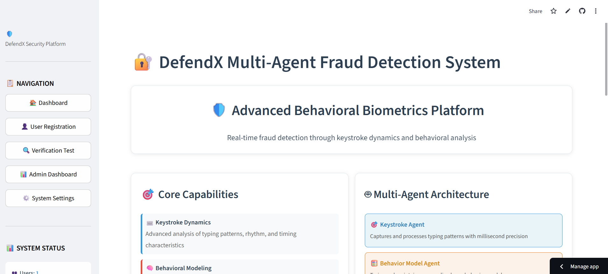
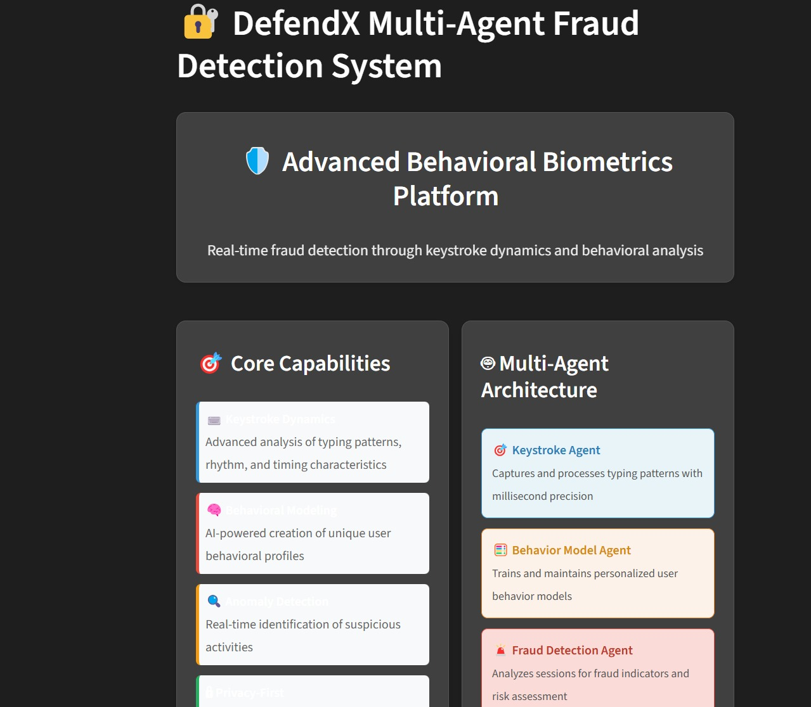
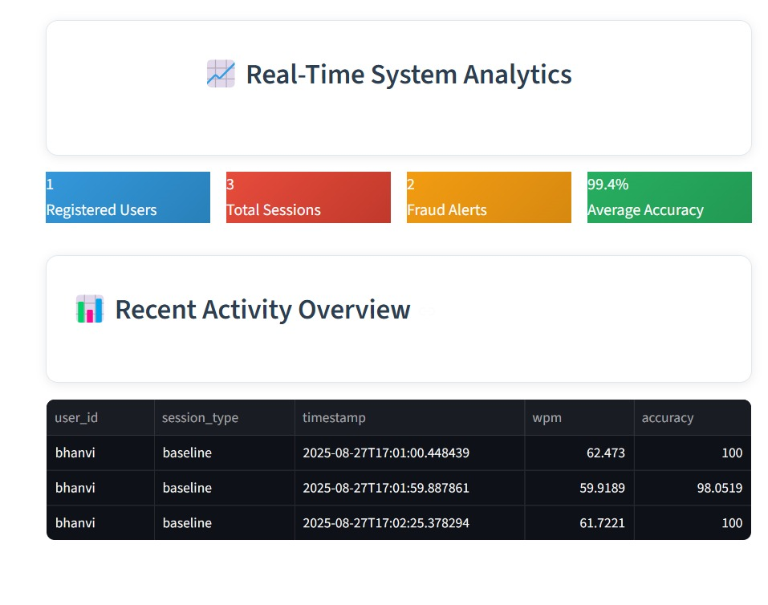
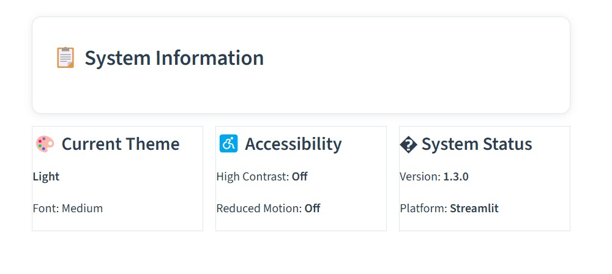
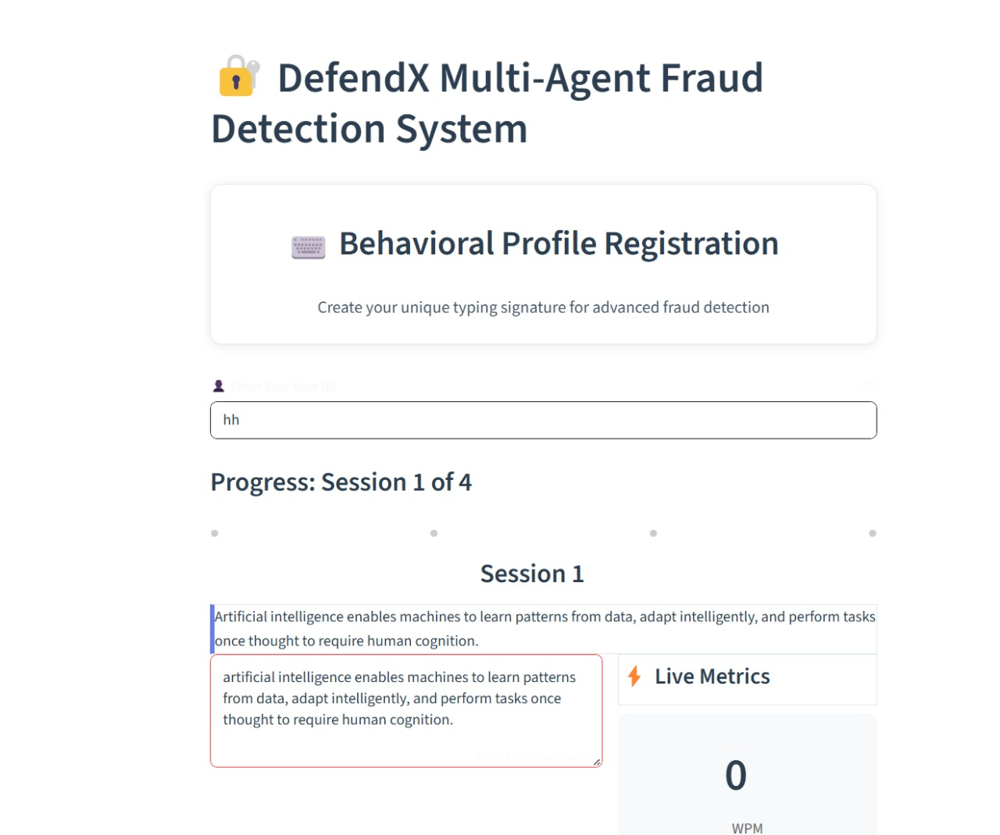

# DefendX On-Device AI based Multi-Agent System for Behavior-Based Anomaly & Fraud Detection
[VISIT DEFENDX](https://defendx.streamlit.app/)


## Overview

DefendX is an advanced multi-agent fraud detection system that analyzes user behavior patterns through keystroke dynamics and behavioral biometrics to identify potential security threats in real-time. The system leverages machine learning algorithms and ensemble anomaly detection to provide robust fraud detection capabilities.


## System Architecture

### Core Components

1. **Multi-Agent Architecture**: Four specialized agents working in tandem
   - KeystrokeAgent: Captures and analyzes typing patterns
   - BehaviorModelAgent: Creates and manages user behavioral profiles
   - FraudDetectionAgent: Analyzes sessions for potential fraud
   - DataManagerAgent: Handles data persistence and management

2. **Web Interface**: Professional Streamlit-based dashboard with:
   - Light/Dark theme support
   - Accessibility features (high contrast, font sizing, reduced motion)
   - Real-time monitoring and analytics
   - User registration and verification system
   - Administrative dashboard

3. **Machine Learning Pipeline**:
   - Ensemble anomaly detection using Isolation Forest and One-Class SVM
   - Behavioral feature extraction from keystroke dynamics
   - Real-time threat assessment and scoring

## Key Features

### Security Features
- **Keystroke Dynamics Analysis**: Captures typing patterns including dwell time, flight time, and rhythm
- **Behavioral Biometrics**: Creates unique user profiles based on typing behavior
- **Real-time Fraud Detection**: Continuous monitoring and instant threat alerts
- **Ensemble Machine Learning**: Multiple algorithms for improved accuracy


### User Experience
- **Professional UI**: Modern, responsive design with professional styling
- **Theme System**: Light/dark mode with accessibility options
- **Real-time Feedback**: Live metrics and performance indicators
- **Administrative Tools**: Comprehensive dashboard for system monitoring


### Technical Features
- **Data Persistence**: CSV-based data storage with session logging
- **Model Management**: Automatic model saving/loading for user profiles
- **Scalable Architecture**: Modular design for easy extension
- **Cross-platform Compatibility**: Works on Windows, macOS, and Linux

## Quick Start

### Prerequisites
- Python 3.8 or higher
- pip package manager

### Installation
```bash
pip install -r requirements.txt
```

### Running the Application
```bash
streamlit run src/app.py
```

The application will be available at `http://localhost:8501`

## Usage

### For End Users
1. **Registration**: Create a new user profile by typing sample text
2. **Training**: Complete multiple training sessions to build your behavioral profile
3. **Verification**: Use the system for ongoing authentication and monitoring

### For Administrators
1. **Dashboard**: Access real-time system statistics and user analytics
2. **Monitoring**: View fraud alerts and system performance metrics
3. **User Management**: Review user profiles and session data

## Technology Stack

### Core Technologies
- **Streamlit**: Web application framework
- **scikit-learn**: Machine learning algorithms
- **pandas**: Data manipulation and analysis
- **plotly**: Interactive visualizations
- **numpy**: Numerical computing

### Machine Learning
- **Isolation Forest**: Anomaly detection algorithm
- **One-Class SVM**: Support vector machine for outlier detection
- **StandardScaler**: Feature normalization
- **Ensemble Methods**: Combined algorithm approach

### Data Management
- **CSV Storage**: Session logs and user data
- **joblib**: Model serialization
- **JSON**: Configuration and profile storage

## Documentation Structure

- `README.md` - This overview document
- `ARCHITECTURE.md` - Detailed system architecture and design patterns
- `API.md` - API reference and code documentation
- `CONTRIBUTING.md` - Guidelines for contributing to the project
- `DEPLOY.md` - Deployment instructions and guidelines

## License

This project is licensed under the MIT License - see the LICENSE file for details.

## Support

For support and questions, please refer to the project repository or contact the development team.
